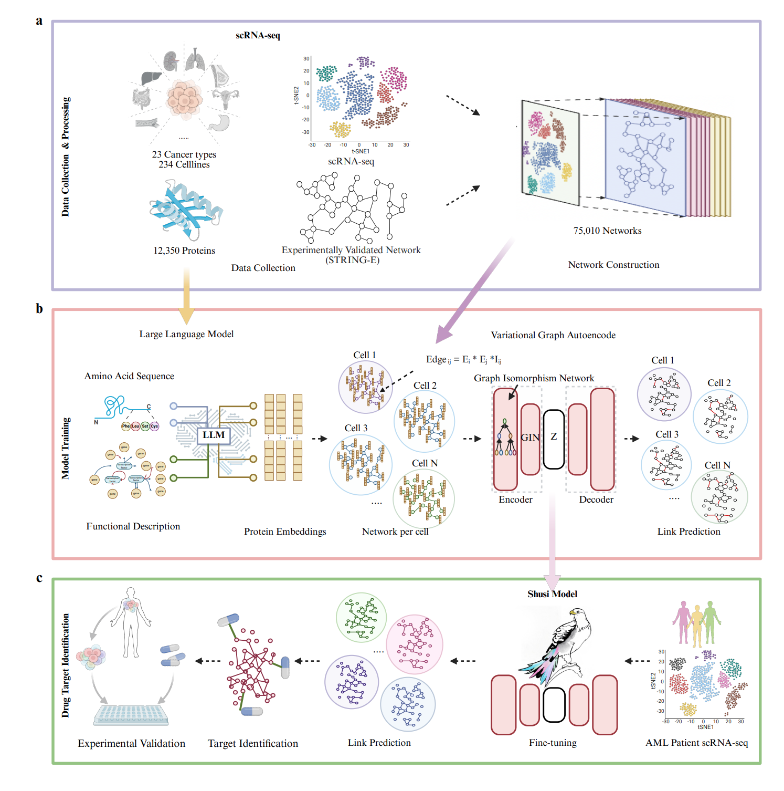

# Systematic discovery of single-cell protein networks in cancer with Shusi



This repository provides **Shusi**, a graph-based framework for systematic discovery of **single-cell protein networks in cancer**. It includes a ready-to-run inference pipeline driven by a single YAML config (`infer_config.yaml`).

Shusi is a multimodal deep learning framework designed to reconstruct protein-knowledge informed single cell gene networks by integrating single-cell transcriptomics with foundational protein knowledge. By leveraging Large Language Models (LLMs) and Graph Isomorphism Networks (GINs), Shusi enables the discovery of cell-state-specific interactomes and therapeutic vulnerabilities in cancer.


## Quickstart: Inference Pipeline

Shusi provides a streamlined inference pipeline. You can manage all parameters through a single configuration file: infer_config.yaml.

### 1) Environment Setup

We recommend using Python 3.9+. Ensure you install PyTorch and its geometric extensions according to your local CUDA version.

```bash
# 1. Install core dependencies
pip install torch numpy scipy

# 2. Install PyTorch Geometric (adjust based on your PyTorch version)
# See: https://pytorch-geometric.readthedocs.io/en/latest/install/installation.html
pip install torch-geometric
```

> Note: PyTorch Geometric wheels depend on your PyTorch/CUDA version. Please install `torch` first, then install `torch-geometric` accordingly.

### 2) Prepare Pretrained Artifacts (not tracked in git)

The model requires specific pretrained weights and feature maps. These are hosted externally due to file size.

- **Model checkpoint** (`checkpoint/shusi.pth`)  
  https://drive.google.com/file/d/1KjIViKOyKaai9cq_yKCKhowmhlXtXNYV/view?usp=drive_link

- **Feature maps**  
  `data/feat_data/embedding_anno_gene.pkl`  
  https://drive.google.com/file/d/1DqXEXzlcHMjg_BddiuhZx9FwC-6JWRo4/view?usp=drive_link  
  `data/feat_data/embedding_anno_sentence.pkl`  
  https://drive.google.com/file/d/1zM9LrHwDwIxgqTNnssl-30JLzckb0Dyy/view?usp=drive_link
  
Deployment Directory Structure: Ensure files are placed as follows:
```bash
.
├── checkpoint/
│   └── shusi.pth
└── data/
    └── feat_data/
        ├── embedding_anno_gene.pkl
        └── embedding_anno_sentence.pkl
```


If you prefer different locations, update the corresponding fields in `infer_config.yaml`:
- `model.ckpt`
- `feat.feat_map1`
- `feat.feat_map2`

### 3) Configure your input graph

Modify infer_config.yaml to point to your data. Shusi supports two processing modes:
- **Single sample**:Best for testing or specific cell populations.
  - `cell.x_path`: path to `*_x.npy`
  - `cell.edge_path`: path to `*_edge.npz`
- **Batch mode**:For processing entire cohorts.
  - `cell.dir`: a directory containing multiple `*_x.npy` + `*_edge.npz` pairs
  - `cell.recursive`: whether to search subfolders

### 4) Run Inference
Execute the pipeline with the following command:
```bash
python inference.py --config infer_config.yaml
```

To generate a predicted-edge CSV, set `mode: predict_all` in `infer_config.yaml`.

## Outputs

The behavior of the pipeline is determined by the mode setting in your YAML config:

- `mode: predict_all` (Discovery)
 This mode performs de novo prediction of novel gene-gene interactions. The results are exported as a CSV file to the directory specified in output.edges_dir.

Output Schema:

```text
gene1,gene2
```

- `mode: eval_masked` (Benchmark) 
  This mode randomly masks a portion of the input edges to evaluate the model's reconstruction accuracy. It outputs precision@10,000 metrics directly to the console.


## Notes

- Hardware: The script defaults to cuda:0. If a GPU is not detected, it will automatically fallback to CPU.

- Path Management: All relative paths in the config are resolved from the repository root.

- Gene Mapping: If a gene_map file is provided in the config, the output CSV will use Gene Symbols; otherwise, it will default to internal Gene IDs.
